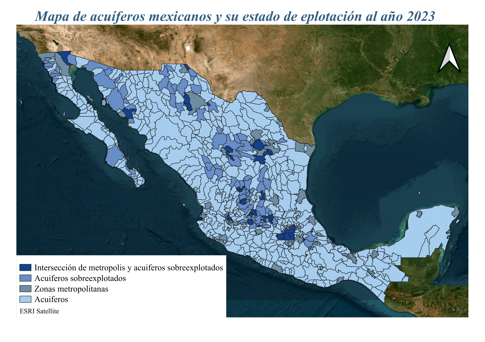

# Acuíferos y abastecimiento hídrico en México

{width=80%}


# Gestión urbana
```{python}
#| message: false
import pandas as pd
import plotly.express as px
import plotly.graph_objects as go
from plotly.subplots import make_subplots
import numpy as np
import geopandas as gpd
```

```{python}
#| output: false
df = pd.read_csv('C:\\Users\\montg\\OneDrive\\Desktop\\Hackods\\hola_hackods\\data\\6n.1.1_sh_es.csv')

df.columns = df.columns.str.strip()

df = df.rename(columns={
    'Entidad_federativa': 'entidad',
    'Periodo': 'año',
    'Población_con_acceso_al_agua_entubada_y_al_saneamiento|Total': 'total',
    'Población_con_acceso_al_agua_entubada_y_al_saneamiento|Hombres': 'hombres',
    'Población_con_acceso_al_agua_entubada_y_al_saneamiento|Mujeres': 'mujeres',
    'Población_con_acceso_al_agua_entubada_y_al_saneamiento|Hablantes_de_lengua_indígena': 'indigena',
    'Población_con_acceso_al_agua_entubada_y_al_saneamiento|Población_con_alguna_discapacidad': 'discapacidad'
})

for col in ['total','hombres','mujeres','indigena','discapacidad']:
    df[col] = pd.to_numeric(df[col], errors='coerce')

df_estatal = df[df['entidad'] != 'Estados_Unidos_Mexicanos']
df_nacional = df[df['entidad'] == 'Estados_Unidos_Mexicanos']

fig2 = px.line(
    df_nacional.sort_values('año'),
    x='año',
    y='total',
    title='Acceso nacional al agua',
    markers=True,
    color_discrete_sequence=['#2a9d8f']
)

fig2.update_layout(template='plotly_white')
fig1 = px.bar(
    df_estatal,
    x='total',
    y='entidad',
    animation_frame='año',
    orientation='h',
    color='total',
    color_continuous_scale='Tealgrn',
    title='Acceso al agua potable por Estado a través del tiempo'
)

fig1.update_layout(template='plotly_white')

df_grupos = df_nacional[['año','total','hombres','mujeres','indigena','discapacidad']]

df_grupos = df_grupos.melt(id_vars='año', var_name='grupo', value_name='porcentaje')

fig3 = px.bar(
    df_grupos,
    x='grupo',
    y='porcentaje',
    animation_frame='año',
    color='grupo',
    color_discrete_sequence=['#264653','#2a9d8f','#e9c46a','#f4a261','#e76f51'],
    title='Acceso por tipo de población'
)


fig3.update_layout(template='plotly_white', yaxis_range=[0,100])

```
## Nacional
```{python}
fig1.show()
```
## Estatal
```{python}
fig2.show()
```
```{python}
fig3.show()
```
# Inundaciones
```{python}
#| output: false
import geopandas as gpd
import plotly.express as px

gdf = gpd.read_file(r'C:\Users\montg\OneDrive\Desktop\Hackods\hola_hackods\data\puntos.geojson')

gdf['lon'] = gdf.geometry.centroid.x
gdf['lat'] = gdf.geometry.centroid.y
```
```{python}
#| output: false
fig_mapa = px.scatter_map(
    gdf,
    lat='lat',
    lon='lon',
    hover_name=gdf.columns[0],
    zoom=5,
    height=600,
    title='Puntos críticas de inundación en México \nFuente: CONAGUA-CENAPRED 2024',
    color_discrete_sequence=['#c9722b']
)

```
## Inundaciones en México
```{python}
fig_mapa.show()     
```
## Afectaciones por inundaciones  
```{python}

#| output: false

df_decesos = pd.DataFrame({
    'raw': [
        "M","H","3H","H","3H, 2M","H","H","4H, 3M","H","H","M","M",
        "3H, M","M","H","H","2H","H","H","H","3H, M","H","H","H",
        "H, M","M","H","H","2H","H, M","H","M","22M, 15H","H","H",
        "H","H","M","2H","3H","H","M","H, M","2H","M","M","H","M",
        "H, 2M","H","H, M","H, M","H","2H","H","M","2H, 2M","H",
        "H, M","H","2H","2H, 4M","2M","H, M","H","H","H, M","H","H"
    ]
})

def separar(val):
    hombres = 0
    mujeres = 0
    
    partes = val.split(',')
    
    for p in partes:
        p = p.strip()
        
        if 'H' in p:
            numero = p.replace('H','')
            hombres += int(numero) if numero != '' else 1
            
        if 'M' in p:
            numero = p.replace('M','')
            mujeres += int(numero) if numero != '' else 1
    
    return pd.Series([hombres, mujeres])

df_decesos[['Hombres','Mujeres']] = df_decesos['raw'].apply(separar)

totales = df_decesos[['Hombres','Mujeres']].sum().reset_index()
totales.columns = ['grupo','decesos']

```
```{python}
#| output: false
fig = px.bar(
    totales,
    x='grupo',
    y='decesos',
    color='grupo',
    color_discrete_sequence=['#457b9d','#e63946'],
    title='Decesos por inundaciones por género (2000 - 2015, CENAPRED)'
)

```
```{python}
fig.show()
```